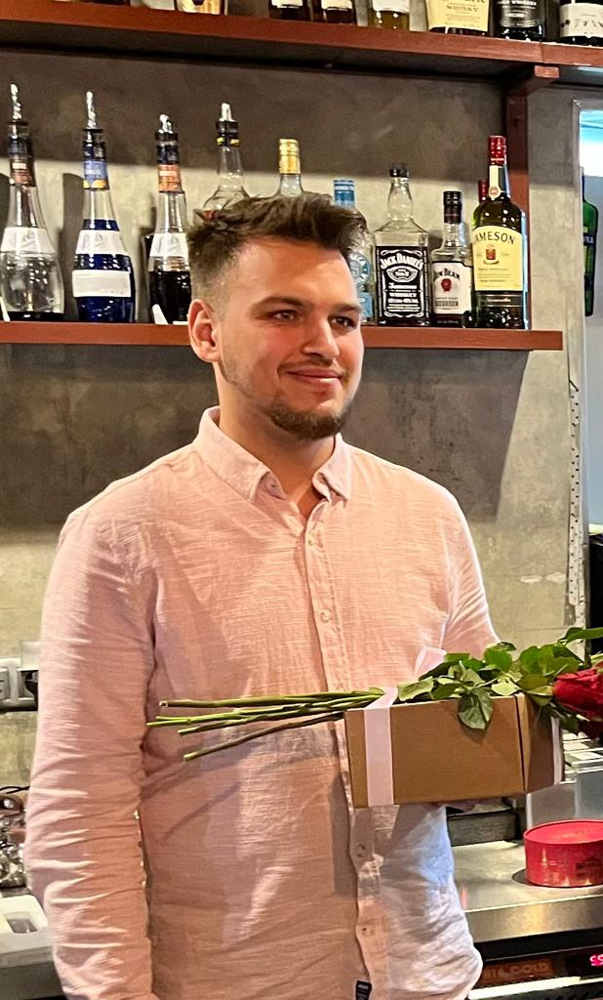

# *Кожевников Александр*

## *Дата рождения: 06.12.1996*

*- Telegram @RestlessBear*

*- github SanyaMon*
  

# __*О себе:*__

 *Я опытный руководитель с более чем 5-летним стажем в другой сфере деятельности, но всегда мечтал начать карьеру в IT. Я всегда стремлюсь завершить задачу в полном объеме и не оставлять за собой никаких недоделок. Имею опыт работы в условиях высокой нагрузки и умею эффективно работать в стрессовых ситуациях. Более того, я быстро обучаем и готов учиться новым технологиям. На данный момент прохожу обучение в онлайн - школе 'Нетология', поэтому ищу возможность начать карьеру в качестве Python-разработчика, где я смогу отточить свои навыки и усовершенствоваться в сфере IT*.
 *Однажды, осознав, что жизнь — бесконечный путь самосовершенствования, я принял решение начать заниматься новым и интересным хобби — учиться, узнавать что-то новое, а также впитывать информацию, которая ранее казалась мне непонятной и даже вызывала отрицание. Я обнаружил, что получение знаний и умений, на первый взгляд кажущихся сложными и необходимыми только профессионалам, дает мне не только уверенность в своих силах, но и расширяет кругозор, помогая лучше понимать окружающий мир и людей в нем. Приобретенные знания и навыки помогают мне не только в повседневной жизни, но и в профессиональном росте и развитии, поэтому я продолжаю развиваться, учиться новому и учиться прошлому, которое раньше вызывало у меня противление.*

*Человек, словно машина, нуждается в регулярном подпитывании своего ума, чтобы не только поддерживать его работоспособность, но и стимулировать его рост и развитие. И, как любой механизм, он требует бережного ухода, чтобы не перегружаться и не выйти из строя, но при этом достигать наивысших результатов и достижений*.

__Предыдущий опыт:__

~~Повар 2 года~~

~~Су-шеф 5 лет~~

Шеф-~~повар~~ 4 года

*В настоящее время учусь в Нетологии*
--

__Год окончания обучения:__
_2024_

